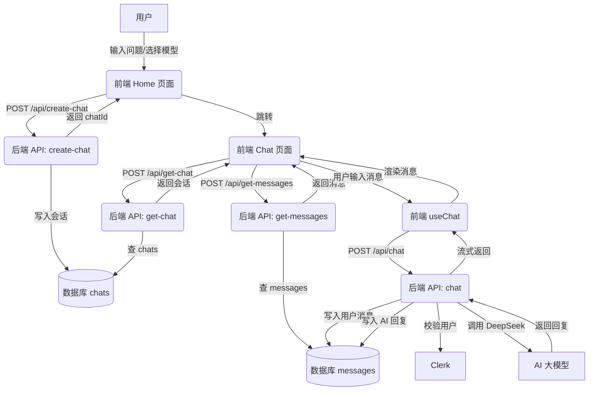

# 项目技术方案说明

## 一、技术栈概览

- **前端框架**：Next.js 15（基于 React 19）
- **UI 组件库**：MUI（Material UI）
- **状态管理与数据请求**：@tanstack/react-query
- **用户认证**：Clerk
- **AI 能力**：@ai-sdk/deepseek，集成 DeepSeek 大模型
- **数据库 ORM**：Drizzle ORM
- **数据库**：Postgres（通过 Supabase 提供）
- **Markdown 渲染**：react-markdown
- **样式**：Tailwind CSS

## 二、系统架构与主要流程

### 1. 页面结构

- 主页面（`/`）：输入问题，选择模型，创建新会话。
- 聊天页面（`/chat/[id]`）：展示历史消息，输入新消息，AI 回复。
- 登录页面（`/sign-in`）：用户认证。
- 侧边栏：展示所有会话，支持切换。

### 2. 前端主要流程

1. 用户在主页面输入问题，选择模型，点击提交。
2. 前端通过 `/api/create-chat` 创建新会话，成功后跳转到 `/chat/[id]`。
3. 聊天页面通过 `/api/get-chat`、`/api/get-messages` 获取会话和历史消息。
4. 用户输入新消息，调用 AI SDK 的 `useChat`，自动向 `/api/chat` 发送请求。
5. AI 回复流式返回，前端实时渲染。

### 3. 后端主要流程

- 所有 API 路由均在 `src/app/api/` 下实现，采用 Next.js API Route 机制。
- 用户认证通过 Clerk 中间件实现，保护除登录页外的所有路由。
- 主要 API：
  - `/api/create-chat`：创建新会话，写入数据库。
  - `/api/get-chat`：获取单个会话信息。
  - `/api/get-chats`：获取当前用户所有会话。
  - `/api/get-messages`：获取某会话的所有消息。
  - `/api/chat`：AI 聊天接口，接收消息，调用 DeepSeek，流式返回回复。

### 4. 数据流与持久化

- 所有会话和消息均存储于 Postgres 数据库。
- 通过 Drizzle ORM 进行类型安全的数据操作。
- 会话表（chats）：id, userId, title, model
- 消息表（messages）：id, chatId, role, content

### 5. AI 能力集成

- 通过 @ai-sdk/deepseek 封装 DeepSeek 大模型。
- 聊天接口 `/api/chat` 支持流式输出，提升用户体验。
- 支持多模型切换（如 deepseek-v3、deepseek-r1）。

### 6. 认证与安全

- 采用 Clerk 进行用户注册、登录、会话管理。
- 所有 API 均校验用户身份，确保数据隔离。

## 三、关键源码结构

- `src/app/page.tsx`：主页面逻辑，创建新会话。
- `src/app/chat/[id]/page.tsx`：聊天页面，消息流转与 AI 调用。
- `src/app/api/`：所有后端接口。
- `src/db/index.ts`：数据库操作方法。
- `src/db/schema.ts`：数据库表结构定义。
- `src/components/side-bar.tsx`：侧边栏组件。

## 四、数据库结构

```ts
// chats 表
id: 主键，自增
userId: 用户 ID
title: 会话标题
model: 使用的模型

// messages 表
id: 主键，自增
chatId: 所属会话 ID
role: 消息角色（user/assistant）
content: 消息内容
```

## 五、主要流程调用图

详见 mermaid 流程图文件。


